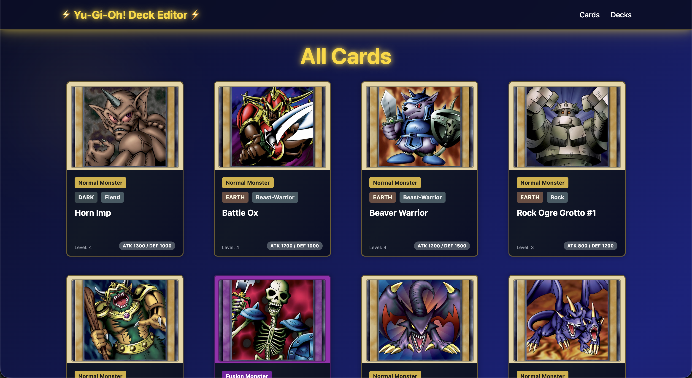
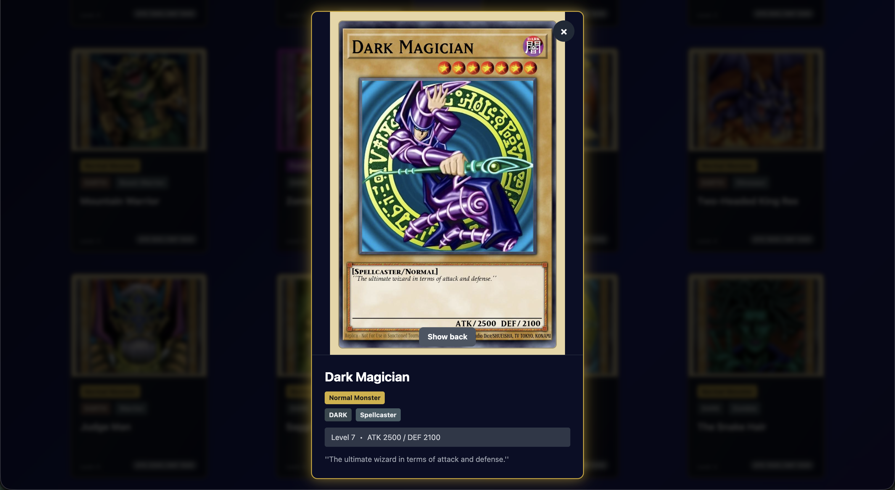
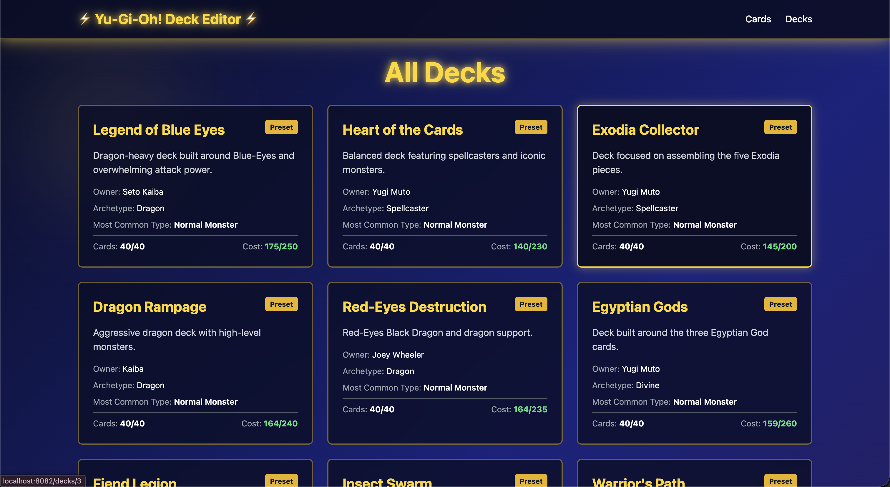
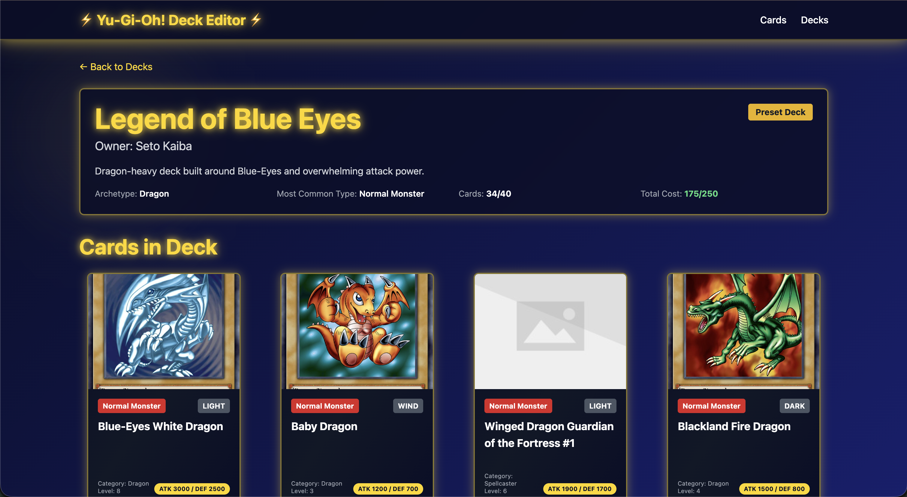

# Yu-Gi-Oh! Deck Editor

   
   
 

Full-stack app for browsing cards and building decks: **Spring Boot** API, **PostgreSQL**, **React** frontend, **Python** scripts for data. Everything runs with **Docker** (or Podman). You get card browsing with pagination, deck list and composition (40 cards), card details, and Swagger API docs; the DB can be reset, migrated, and seeded from CSV.

**Setup:** For what to install (Docker, Podman, macOS/Homebrew, etc.), see **[Setup guide](docs/SETUP_AND_TESTS.md)**.

---

## Quick start

1. **Prereqs:** Docker + Compose — see [Setup guide](docs/SETUP_AND_TESTS.md) for install steps.
2. **Run** (from repo root):
   ```bash
   docker compose up --build
   ```
3. **Open:**

   | Service | URL |
   |---------|-----|
   | **Frontend** | http://localhost:8082 |
   | **Swagger UI** | http://localhost:8080/swagger-ui.html |
   | **Health** | http://localhost:8080/healthcheck |

   *First run runs migrations and seeds the DB from CSV automatically.*

4. **Tests** (no DB): `docker compose --profile test build` — see [Tests](docs/TESTS.md) for per-project commands and Podman.

---

## Run & links

| Service | URL | Description |
|---------|-----|-------------|
| **Frontend** | http://localhost:8082 | Cards grid, decks list; click a card for details, a deck for composition. |
| **Swagger UI** | http://localhost:8080/swagger-ui.html | Interactive API docs; try `GET /cards`, `GET /decks`. |
| **Health** | http://localhost:8080/healthcheck | Backend health check. |

---

## Per-project

| Project | Dockerfile | README |
|---------|------------|--------|
| Backend | [backend/Dockerfile](backend/Dockerfile) | [backend/README.md](backend/README.md) |
| Frontend | [frontend/Dockerfile](frontend/Dockerfile) | [frontend/README.md](frontend/README.md) |
| Scripts | [scripts/Dockerfile](scripts/Dockerfile) (stages: test, default; build from repo root) | [scripts/README.md](scripts/README.md) |

---

## Documentation

| When you want to… | Doc |
|-------------------|-----|
| **Get running** — setup, run app (Docker/Podman) | [SETUP_AND_TESTS](docs/SETUP_AND_TESTS.md) |
| **Run tests** — per-project, Podman, native, CI | [TESTS](docs/TESTS.md) |
| **Use the app** — URLs, Swagger, frontend usage | [GETTING_STARTED](docs/GETTING_STARTED.md) |
| **Work on code** — backend/frontend locally (no containers) | [DEVELOPMENT](docs/DEVELOPMENT.md) |
| **Database** — reset, migrate, seed, check data | [DATABASE_MAINTENANCE](docs/DATABASE_MAINTENANCE.md) |
| **Schema** — migrations, adding tables | [DATABASE_MIGRATIONS](docs/DATABASE_MIGRATIONS.md) |
| **API** — endpoints, examples | [API_ENDPOINTS](docs/API_ENDPOINTS.md) |
| **Layout** — repo structure | [PROJECT_STRUCTURE](docs/PROJECT_STRUCTURE.md) |
| **Problems** — common errors and fixes | [TROUBLESHOOTING](docs/TROUBLESHOOTING.md) |
| **Stack** — technologies and tools | [TECHNOLOGY_STACK](docs/TECHNOLOGY_STACK.md) |
| **License** | [LICENSE](docs/LICENSE.md) |

---

## Website preview

Screenshots in [docs/screenshots/](docs/screenshots/):

| Page | Preview |
|------|---------|
| Cards |  |
| Card detail |  |
| Decks list |  |
| Deck composition |  |
